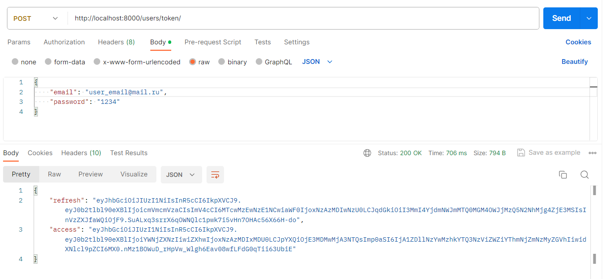

# Electronics Sale Network

## Description of the task
Implement an electronics retail chain model. The network should be a hierarchical structure of 3 levels:
- Factory;
- Retail network;
- Individual entrepreneur.

Each link in the network refers to only one equipment supplier (not necessarily the previous one in the hierarchy). It is important to note that the hierarchy level is determined not by the name of the link, but by its relationship to other elements of the network, i.e. The plant is always at level 0, and if the retail network relates directly to the plant, bypassing other links, its level is 1.

Each link in the network must have the following elements:
- Name;
- Contacts:
- - Email;
- - A country;
- - City;
- - Street;
- - House number;
- Products:
- - Name;
- - Model;
- - Date of product launch on the market;
- Supplier (the previous network object in the hierarchy);
- Debt to the supplier in monetary terms, accurate to the nearest kopeck;
- Creation time (filled in automatically upon creation).

## Set Up your personal settings
Create a `.env` configuration file with your personal settings in the root of the project, according to the sample, specified in `.env.sample`. Fill out the file according to your personal data. 

Create a database in postgresql. The name of the database must match the name specified in the file. Run migrations using the command `python manage.py migrate`.

## Create users
To create users use the following commands:
- `python manage.py create_user`
- `python manage.py create_admin`

Users (only active) can work with API. Admin has access to work with the administrative panel.

## Running
To run the project, enter the `python manage.py runserver` command in the terminal.

## Usage
### Get access token
To work with the platform, authorization is required. To do this, after user registration, use your email and password to receive a token. When sending a request to the platform, use the received token in the Authorization section.

### Work with API
You can use the following links to read the documentation. It describes the details of working with the project API.

- http://127.0.0.1:8000/docs/ 
- http://127.0.0.1:8000/redoc/