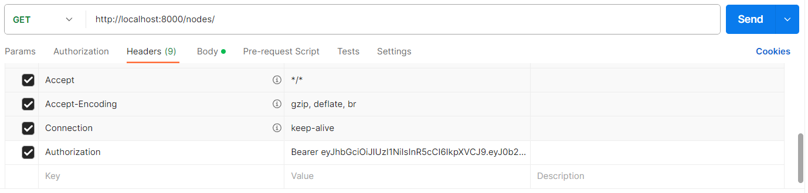

# Electronics Sale Network Management System

## Description
This web application provides a comprehensive solution for managing an electronic sales network, featuring a hierarchical structure of factories, retail networks, and individual entrepreneurs. The system includes an API interface for CRUD operations and an admin panel for efficient data management.

### Main points

- **Hierarchical Network Structure**: The application models a three-tier structure of the electronic sales network, consisting of factories, retail networks, and individual entrepreneurs. Each network node can refer to a supplier, which is not necessarily the preceding node in the hierarchy.

- **Detailed Node Information**: Each network node includes:
  - Name
  - Contact Information: Email, Country, City, Street, House Number
  - Products: Name, Model, Market Release Date
  - Supplier Information
  - Debt to the Supplier (with precision up to cents)
  - Creation Time (auto-filled on creation)

- **Admin Panel**: Custom Django admin panel for managing network nodes, including:
  - Display of created objects
  - Links to suppliers
  - City filter
  - Custom admin action to clear debts of selected objects

- **API Interface**: Developed with Django REST Framework (DRF) for managing supplier model with CRUD operations. The update of debt field via API is restricted.

- **Advanced Filtering**: Allows filtering objects by a specific country.

- **Access Control**: API access is restricted to active employees only, ensuring secure operations.

## Set Up your personal settings
Create a `.env` configuration file with your personal settings in the root of the project, according to the sample, specified in `.env.sample`. Fill out the file according to your personal data. 

Create a database in postgresql. The name of the database must match the name specified in the file. Run migrations using the command `python manage.py migrate`.

## Create users
To create users use the following commands:
- `python manage.py create_user`
- `python manage.py create_admin`

Users (only active) can work with API. Admin has access to work with the administrative panel.

## Running
To run the project, enter the `python manage.py runserver` command in the terminal.

## Usage
### Get access token
To work with the platform, authorization is required. To do this, use your email and password to receive a token. When sending a request to the platform, use the received token in the Authorization section.

### Work with API
You can read full documentation at <host>/docs/ or <host>/redoc/. It describes the details of working with the project API.

### Admin panel
Access the admin panel at <host>/admin to manage the network nodes. The admin panel provides functionalities to create, update, view, and delete network nodes, along with the custom functionalities mentioned above.